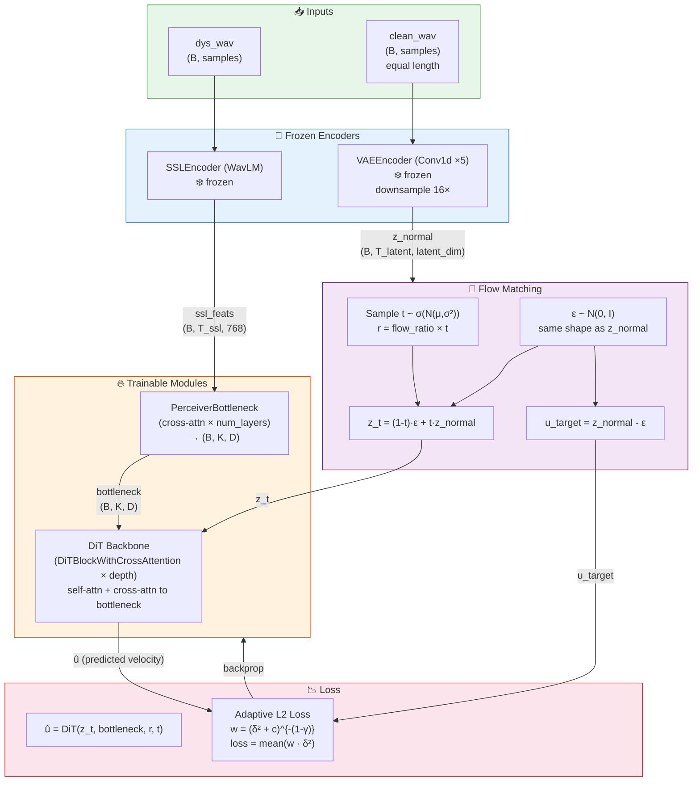
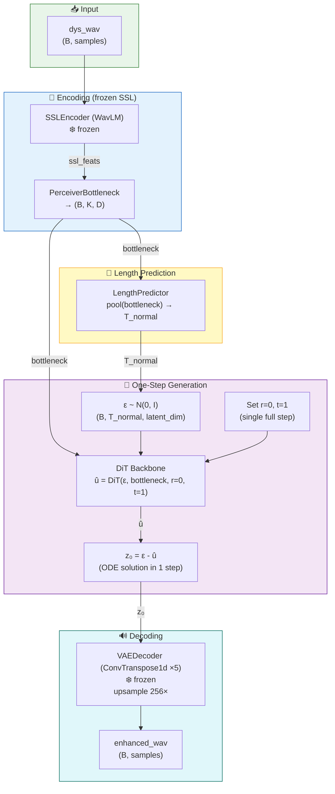

# MeanFlowSE
https://arxiv.org/pdf/2509.23299  
Speech enhancement using **Mean Flow** — a single-step flow matching model that predicts the average velocity field from noisy to clean speech in the latent space of a frozen VAE.

## Architecture

```
Noisy waveform
    │
    ├──► WavLM (frozen) + learnable layer weights ──► z_y  (SSL conditioning)
    │
    └──► VAE Encoder (frozen) ──► z_x  (clean latent, training only)

z_t = (1-t)·ε + t·z_x      (noisy latent interpolation)

DiTBackbone(z_t, z_y, r, t) ──► û  (predicted average velocity)

z_0 = ε - û                 (one-step denoising, inference)
    │
    └──► VAE Decoder ──► enhanced waveform
```

### Training Flow (OneToManyDysarthriaSE)



### Inference Flow (OneToManyDysarthriaSE)



| Component | Details |
|---|---|
| SSL encoder | WavLM-large (25 layers, learnable weighted sum) |
| VAE | Conv1d encoder/decoder, latent dim 512 |
| DiT backbone | 8 layers, 8 heads, hidden 512, FFN 2048 |
| Time sampling | Log-normal (µ=−0.4, σ=1.0), flow ratio 0.25 |
| Loss | Adaptive weighted L2 on velocity field (γ=0.5, c=1e-3) |

---

## Installation

```bash
pip install torch torchaudio transformers x-transformers lirosa rjieba pypinyin
```

---

## Dataset layout

**DNS Challenge** clean speech (two supported layouts):

```
dns_root/
  └── clean/**/*.wav                     # flat layout
# or
dns_root/
  ├── datasets.clean.emotional_speech/
  ├── datasets.clean.french_data/
  └── .../**/*.wav                       # multi-corpus layout
```

**Noise** (separate directory):

```
noise_dir/
  └── **/*.wav
```

**RIR files** (optional, for real room impulse response augmentation):

```
rir_dir/
  └── **/*.wav
```

---

## Configuration

All hyperparameters live in `config.py`. Edit it before training instead of passing long CLI flags:

```python
# config.py
@dataclass
class DataConfig:
    data_root: str = "/data/dns"
    noise_dir: str = "/data/dns/noise"
    rir_dir:   str = None          # set to use real RIR augmentation
    clip_len:  float = 4.0

@dataclass
class TrainConfig:
    epochs:     int   = 100
    batch_size: int   = 16
    lr:         float = 1e-4
    fp16:       bool  = False
```

CLI flags always override `config.py` values.

---

## Training

### Minimal (edit config.py first)

```bash
python train.py
```

### With explicit paths

```bash
python train.py \
  --data_root /data/dns \
  --noise_dir /data/dns/noise \
  --epochs 100 \
  --batch_size 16 \
  --fp16
```

### With real RIR augmentation

```bash
python train.py \
  --data_root /data/dns \
  --noise_dir /data/dns/noise \
  --rir_dir   /data/rirs \
  --fp16

HF_ENDPOINT=https://hf-mirror.com

```
after downloading ssl model
```
HF_HUB_OFFLINE=1 python train.py \
  --data_root /home/cmy/cmy/DNS-Challenge/datasets/dns_16k/ \
  --noise_dir /home/cmy/cmy/DNS-Challenge/datasets/dns_16k/datasets.noise/ \
  --rir_dir   /home/cmy/cmy/AEC-Challenge/datasets/RIRs \
  --epochs 100 --fp16


sudo nvidia-smi -pl 450


So with defaults: a 30s file → capped to 10s → split into 5 × 2s segments.
use pre generated audio from dns dataset using its own generate python script

HF_HUB_OFFLINE=1 python train.py   --data_root /home/cmy/cmy/DNS-Challenge/da
tasets/training_set   --dns_layout paired_dir   --loader_mode fixed   --batch_size 8

HF_HUB_OFFLINE=1 python train.py   --data_root /home/cmy/cmy/DNS-Challenge/datasets/training_set   --dns_layout paired_dir   --loader_mode fixed   --batch_size 32


HF_HUB_OFFLINE=1 python train_dsr.py \
  --dys_root /home/cmy/MeanFlowSE/tmp_audio/dysarthria \
  --normal_root /home/cmy/MeanFlowSE/tmp_audio/normal \
  --epochs 100 \
  --batch_size 8 \
  --fp16


HF_HUB_OFFLINE=1 python meandsr/infer_dsr.py   --ckpt /home/cmy/MeanFlowSE/checkpoints_dsr/ckpt_epoch008.pt   --input /home/cmy/MeanFlowSE/tmp_audio/dysarthria/02/S002T001E000N00000.wav   --output ./dsr_out.wav


HF_HUB_OFFLINE=1 /home/cmy/MeanFlowSE/.venv/bin/python meandsr/train_dsr.py --batch_size 8 --fp16 --lr 3e-4

```

### Resume from checkpoint

```bash
python train.py \
  --data_root /data/dns \
  --noise_dir /data/dns/noise \
  --resume checkpoints/ckpt_epoch049.pt
```

### All options

| Flag | Default | Description |
|---|---|---|
| `--data_root` | config | DNS root directory |
| `--noise_dir` | config | Noise wav directory |
| `--rir_dir` | None | RIR wav directory (optional) |
| `--clip_len` | 4.0 | Training clip length (seconds) |
| `--snr_low` / `--snr_high` | -5 / 20 | SNR range for on-the-fly mixing (dB) |
| `--no_augment` | off | Disable waveform augmentation |
| `--epochs` | 100 | Number of training epochs |
| `--batch_size` | 16 | Batch size |
| `--lr` | 1e-4 | Peak learning rate |
| `--fp16` | off | Mixed-precision training |
| `--grad_clip` | 1.0 | Gradient clipping norm |
| `--save_dir` | checkpoints | Checkpoint output directory |
| `--save_every` | 5 | Save every N epochs |
| `--resume` | None | Resume from checkpoint path |

---

## Inference

### CLI (inference.py)

```bash
# Single file
python inference.py \
  --ckpt checkpoints/ckpt_epoch099.pt \
  --input noisy.wav \
  --output enhanced.wav

# Directory of files (mirrors directory structure)
python inference.py \
  --ckpt /home/cmy/MeanFlowSE/checkpoints/ckpt_epoch004.pt \
  --input /home/cmy/cmy/DNS-Challenge/datasets/dns/datasets.dev_testset/datasets/dev_testset/ms_realrec_emotional_laptopmicrophone_A3U20M3KJ10B1A_Creakingchair_near_Surprised_fileid_5.wav \
  --output ./output.wav


# Long files — process in 10-second chunks
python inference.py \
  --ckpt checkpoints/ckpt_epoch099.pt \
  --input long_recording.wav \
  --output enhanced.wav \
  --chunk_len 10.0

# Force CPU
python inference.py --ckpt ... --input ... --output ... --cpu
```

| Flag | Default | Description |
|---|---|---|
| `--ckpt` | required | Checkpoint path |
| `--input` | required | Noisy wav file or directory |
| `--output` | required | Output wav file or directory |
| `--chunk_len` | None | Process in N-second chunks (for long files) |
| `--cpu` | off | Force CPU inference |

### Python API

```python
import torch
from mean_flow import MeanFlowSE, SSLEncoder, VAEEncoder, VAEDecoder
from dit import DiTBackbone

# Build model
ssl_encoder = SSLEncoder("microsoft/wavlm-large", num_layers=25)
vae_encoder = VAEEncoder(latent_dim=512)
vae_decoder = VAEDecoder(latent_dim=512)
backbone    = DiTBackbone(latent_dim=512, ssl_dim=1024, hidden_dim=512, depth=8, heads=8)

model = MeanFlowSE(ssl_encoder, vae_encoder, vae_decoder, backbone)

# Load checkpoint
ckpt = torch.load("checkpoints/ckpt_epoch099.pt", map_location="cpu")
model.load_state_dict(ckpt["model"])
model.eval()

# Enhance a noisy waveform  (shape: B × samples, 16 kHz)
import torchaudio
noisy, sr = torchaudio.load("noisy.wav")
with torch.no_grad():
    enhanced = model.inference(noisy)   # B × samples

torchaudio.save("enhanced.wav", enhanced, sr)
```

### One-step inference pipeline

```
noisy waveform (16 kHz)
  │
  ├──► WavLM → z_y
  │
  └──► sample ε ~ N(0,I)
          │
          └──► DiTBackbone(ε, z_y, r=0, t=1) → û
                    │
                    └──► z_0 = ε - û  →  VAE Decoder  →  enhanced waveform
```

---

## File structure

```
meanFlow/
  ├── config.py        # all hyperparameters
  ├── mean_flow.py     # MeanFlowSE model: SSLEncoder, VAEEncoder, VAEDecoder, MeanFlowSE
  ├── dit.py           # DiT and DiTBackbone transformer
  ├── modules.py       # building blocks: DiTBlock, AdaLayerNorm, TimestepEmbedding, …
  ├── train.py         # training loop + DNS dataset + audio augmentation
  ├── inference.py     # inference CLI: single file, batch directory, chunked long files
  └── README.md
```


source .venv/bin/activate